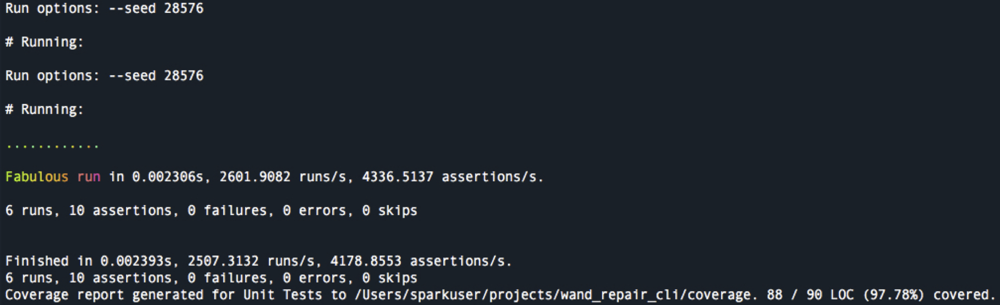
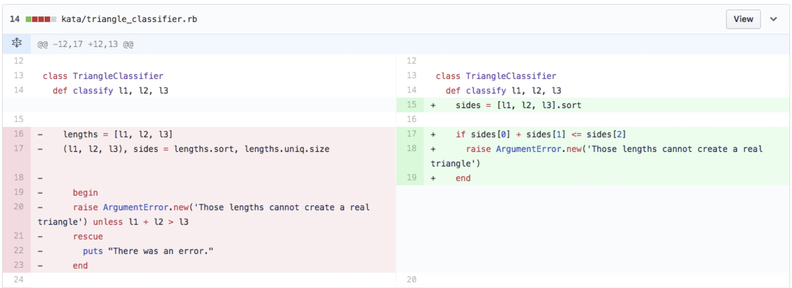
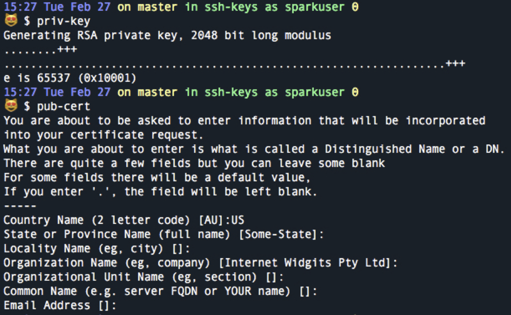

### Wand Repair Shop




### Katas
#### Tirangle Kata & FizzBuzz Kata
_i was able to practice TDD_
* I tried to make a commit after every single change to practice Red, Green, Refractor
* And practiced writing detailed commits




_test before_
```ruby
def test_if_an_argument_error_is_raised_when_numbers_cant_create_real_triangle
  assert_output(/There was an error./) { @tri.classify(0, 2, 3) }
  assert_output(/There was an error./) { @tri.classify(0, 0, 0) }
  assert_output(/There was an error./) { @tri.classify(-10, -20, 12) }
end
```

_test after_
```ruby
def test_if_an_argument_error_is_raised_when_numbers_cant_create_real_triangle
   assert_raises(ArgumentError) { @tri.classify(2, 3, 1) }
end
```

### Web Scrapping
_i was thinking about goals and my interest in data which led my to think about how I could get data and then tell a story though it. That led me to web scrapping_
   * used nokogiri to scrape
   * used yaml to store
   * scrapped seesparkbox.com to see what I could do
   * interested in using that capability for a future project

```ruby
h1  = doc.at_css('h1')      # assigns the h1 to the var h1
h1.content = "Hello there." # sets the title content to the string
h1['class'] = 'greeting'    # adds class to the h1

h1.add_next_sibling "\n\t<h2>General Kenobi</h2>" # adds an h2 after the h1
h2 = doc.css("h2").first                          # assigns h2 to the first h2 of the doc
h2 = doc.xpath("//h2").first                      # another way to get the h2
h2['class'] = 'jedi-scum'                         # adds class to h2
```

 _used this opportunity to learn a bit about YAML_

```ruby
store = YAML::Store.new "links.store"

store.transaction do
  store["title"] = { "links" => "sparkbox" }
  store["list"] = link_items
  puts "stored data"
end
```


### Blockchain

_found blockchain-lite gem which led me to wonder how that would work_
  * interested in: blockchain in general

```ruby
def calc_hash
  sha = Digest::SHA256.new # uses the digest gem to create a new SHA
  sha.update(@index.to_s + @timestamp.to_s + @data + @previous_hash)
  sha.hexdigest
end

def self.first(data="Genesis") # set default data to the string
  Block.new( 0, data, "0")     # set index as zero and previous hash as zero
end

def self.next(previous, data="Transaction Data...") # set parameters and default data
  Block.new(previous.index+1, data, previous.hash)  # sets index to previous block + 1, hash to previous hash
end
```


### SSH Keys

_what is SSH & how to create one_
 * secure  way of working with remote environments
 * interested in: security and encryption

 ```
Create private key `openssl genrsa -out private.pem 2048`

Create the corresponding public certificate `openssl req -new -x509 -key private.pem -out cert.pem -days 1095`
```


