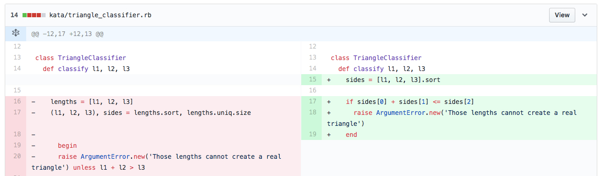

### Hot Dog Stand
_probably the most challenging because I had to learn how to learn as well as understand OOP and programing theory_
* started by laying out the project structure and filled in some code
* helped to pair on ways to improve the structure

First piece of code I wrote for the hot dog stand
```ruby
class MenuController
  def show_menu
    puts "\nWhat are you looking for today?\n-------------------------------"
    ["1. Place an order", "2. Quit"].each do |items|
      puts items
    end
    print "-->"
    user_input = $stdin.gets.chomp.to_i
    case user_input
    when 1
      order.place_order
    when 2
      puts "Goodbye, hope to see you again!"
      exit(0)
    else
      while user_input > 2
        puts "\nWe don't offer that here. \nPlease enter a valid option.\n----------------------------\n"
        print "-->"
        user_input = gets.chomp.to_i
      end
    end
  end
  show_menu
```
### Wand Repair Shop
_i wanted to see if I really understood OOP & Ruby by creating a slightly different hot dog type stand program. And I wanted to try TDD_
* Used this opportunity to learn JSON, set up test coverage, and focus on different ways to solve the same problem

TDD


_Challenge to have values show based on keys_

started off with:
```ruby
  def start
    step 1
    step 2
    step 3
    step 4
    step 5
  end
```

instead of separating the keys and values into different variables and calling on those
I was able to have all the data associate to one variable
refactored to:
```ruby
def get_questions_n_responses
  elements.each do |keys, values|
    show_question keys
    choose_value keys, values
  end
  @choice
end
```

### Katas
#### Tirangle Kata
_i was able to practice TDD_
* I tried to make a commit after every single change to practice Red, Green, Refractor
* And practiced writing detailed commits

fix sorting on array


_test before_
```ruby
def test_if_an_argument_error_is_raised_when_numbers_cant_create_real_triangle
  assert_output(/There was an error./) { @tri.classify(0, 2, 3) }
  assert_output(/There was an error./) { @tri.classify(0, 0, 0) }
  assert_output(/There was an error./) { @tri.classify(-10, -20, 12) }
end
```

_test after_
```ruby
def test_if_an_argument_error_is_raised_when_numbers_cant_create_real_triangle
   assert_raises(ArgumentError) { @tri.classify(2, 3, 1) }
end
```

### Web Scrapping
_i was thinking about goals and my interest in data which led my to think about how I could get data and then tell a story though it. That led me to web scrapping_
   * used nokogiri to scrape
   * used yaml to store
   * scrapped seesparkbox.com to see what I could do
   * interested in using that capability for a future project

```ruby
h1  = doc.at_css('h1')      # assigns the h1 to the var h1
h1.content = "Hello there." # sets the title content to the string
h1['class'] = 'greeting'    # adds class to the h1

h1.add_next_sibling "\n\t<h2>General Kenobi</h2>" # adds an h2 after the h1
h2 = doc.css("h2").first                          # assigns h2 to the first h2 of the doc
h2 = doc.xpath("//h2").first                      # another way to get the h2
h2['class'] = 'jedi-scum'                         # adds class to h2
```

 _used this opportunity to learn a bit about YAML_

```ruby
store = YAML::Store.new "links.store"

store.transaction do
  store["title"] = { "links" => "sparkbox" }
  store["list"] = link_items
  puts "stored data"
end
```


### Blockchain

_found blockchain-lite gem which led me to wonder how that would work_

```ruby
def calc_hash
  sha = Digest::SHA256.new # uses the digest gem to create a new SHA
  sha.update(@index.to_s + @timestamp.to_s + @data + @previous_hash)
  sha.hexdigest
end

def self.first(data='Genesis') # set default data to the string
  Block.new( 0, data, '0')     # set index as zero and previous hash as zero
end

def self.next(previous, data='Transaction Data...') # set parameters and default data
  Block.new(previous.index+1, data, previous.hash)  # sets index to previous block + 1, hash to previous hash
end
```


### Generating Keys

* SSH Keys
* ECSDA Certificate

### Encryption
* Simple 30 line program to encrypt and then decrypt a message. So far, it asks for the user create the message. I chose a AES 256 CBC for the cipher.
* And encrypting a password using PKCS5.pbkdf2_hmac_sha1.


